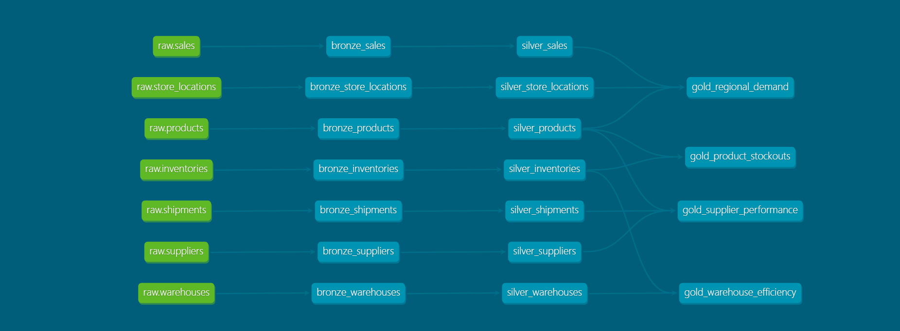

# SupplyChain360: Enterprise Data Pipeline

An operational analytics platform designed to provide "reliable" insights into global supply chain logistics. This project implements a modern data stack using the **Medallion Architecture** to transform raw ingestion into high-value business intelligence.

---

## 🏗️ Architecture Overview

The pipeline follows the three-tier Medallion structure, orchestrated via **Apache Airflow** and modeled with **dbt Core**.

* **Bronze (Staging):** Raw ingestion from source systems (PostgreSQL/S3) with appended metadata (`_ingested_at`).
* **Silver (Cleansing):** Incremental and Table-based models. Standardized IDs using `UPPER(TRIM())`, deduplication via `ROW_NUMBER()`, and surrogate key generation via custom MD5 macros.
* **Gold (Marts):** Business-ready, denormalized tables (prefixed with `gold_`) optimized for analytical querying.

---

## 📊 Analytical Use Cases

The **Gold Layer** is specifically modeled to support four core pillars of supply chain health:

1.  **Product Stockout Trends:** Identifying inventory risks and prioritizing replenishment for high-value items.
2.  **Supplier Delivery Performance:** Tracking carrier reliability and vendor lateness flags.
3.  **Warehouse Efficiency:** Monitoring unit-on-hand volumes and unique product density across facilities.
4.  **Regional Sales Demand:** Aggregating net revenue and quantity sold across geographic tiers (Region/State/City).

---

## 🛠️ Tech Stack

* **Data Warehouse:** Snowflake (Production) / PostgreSQL (Local Dev)
* **Transformation:** dbt Core (v1.x)
* **Orchestration:** Apache Airflow
* **Infrastructure:** AWS (Provisioned via Terraform)
* **Environment:** WSL2 (Ubuntu) / Docker

---

## 📊 Project Lineage
The following graph illustrates the data flow from raw source seeds/tables through the enrichment layers to the final analytical marts:



## 🚦 How to Run
1.  
    cd dbt/supplychain360
    ```
2.  **Install Dependencies:**
    ```bash
    dbt deps
    ```
3.  **Run & Test Entire Pipeline:**
    ```bash
    dbt build
    ```
4.  **Generate Documentation:**
    ```bash
    dbt docs generate
    dbt docs serve
    ```