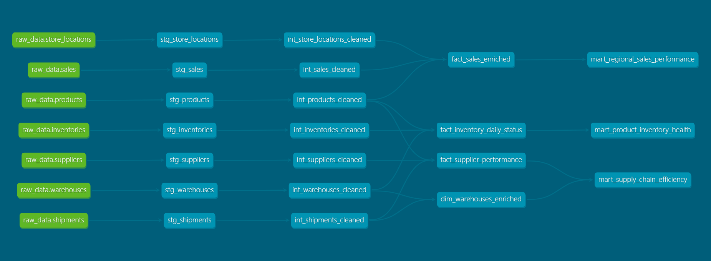

# 📦 Supply Chain 360: Snowflake Analytics Platform

An enterprise-grade data transformation pipeline built with **dbt (Core)** and **Snowflake**, following the **Medallion Architecture**. This platform is engineered for high-performance, cost-efficient processing of daily supply chain logs.

## 🚀 Business Impact & Key Insights
This platform turns raw data into strategic assets through specialized Gold-layer Marts:

* **Regional Sales Performance:** Automated monthly revenue aggregation, identifying shifting consumer demand patterns across geographic regions.
* **Supplier Delivery Reliability:** Engineered an **On-Time Delivery Rate (OTDR)** KPI to rank vendor reliability and optimize the procurement network.
* **Warehouse Efficiency:** Identified logistics bottlenecks by calculating `avg_delay_days`, enabling data-driven process audits at underperforming sites.
* **Inventory Health & Stockouts:** Implemented a **Stockout Rate %** metric to flag "Critical Unreliable" products and reduce lost sales opportunities.

## 🏗️ Data Architecture (Medallion)
The project utilizes a multi-layered approach optimized for **Snowflake's** compute model:

* **Bronze (Staging):** Raw data ingestion with initial schema enforcement.
* **Silver (Incremental Layer):** * **Performance Engineering:** Implemented **Incremental Materialization** using `unique_key` and `MERGE` logic to minimize Snowflake credit consumption.
    * **Intermediate:** Data type casting, string standardization (Initcap), and null handling.
    * **Enriched:** Denormalized Fact & Dimension tables utilizing **custom Jinja macros** for MD5 surrogate key generation.
* **Gold (Marts):** High-level, pre-aggregated business views optimized for BI consumption.

## 📊 Data Lineage & Flow
The following Directed Acyclic Graph (DAG) illustrates the modular dependency structure of the pipeline. It highlights how raw sources flow through incremental silver transformations to produce the final analytical gold marts.




## 🛠️ Technical Stack
* **Cloud Data Warehouse:** Snowflake
* **Orchestration:** dbt Core (v1.8+)
* **Environment:** Windows Subsystem for Linux (WSL 2) / Ubuntu
* **Transformation Logic:** * **Incremental Loading:** Processing only new records based on `bronze_ingested_at` timestamps.
    * **Macros:** Custom `generate_surrogate_key` for idempotent, null-safe hashing.

## 🧪 Quality & Testing
Data integrity is enforced at every layer through automated dbt tests:
* **Generic Tests:** `unique`, `not_null`, and `accepted_values` on all primary and foreign keys.
* **Idempotency:** Incremental logic designed to prevent duplicate records during job re-runs.
* **Defensive Coding:** Explicit type casting in Snowflake to ensure mathematical accuracy (e.g., handling numeric precision for `sale_amount_usd`).

## 🚦 How to Run
1.  **Configure Profile:** Ensure your `profiles.yml` is set up for Snowflake authentication. See example_profil.yml
2.  **Install Dependencies:**
    ```bash
    dbt deps
    ```
3.  **Full Refresh (First Run Only):**
    ```bash
    dbt run --full-refresh
    ```
4.  **Incremental Build & Test:**
    ```bash
    dbt build
    ```
5.  **View Documentation:**
    ```bash
    dbt docs generate && dbt docs serve
    ```

---
*Developed by Faruk Sedik as a modern data stack capstone project.*